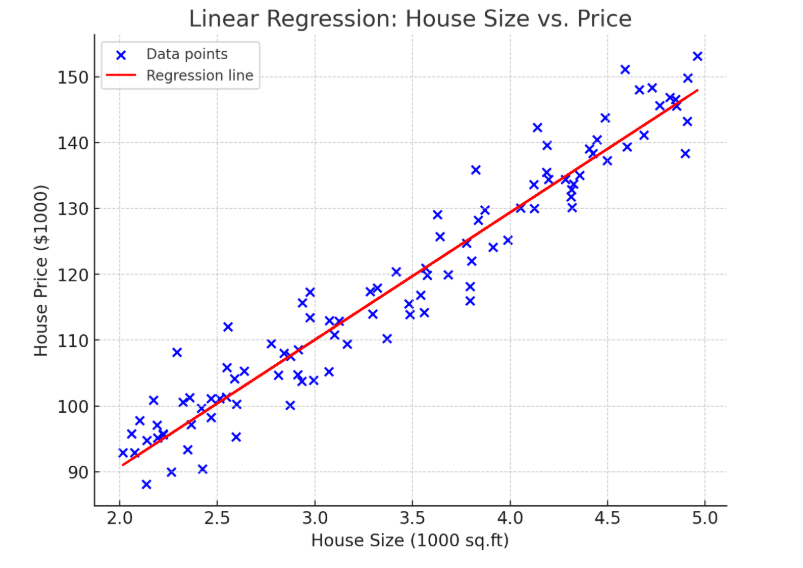

# Linear Regression

Linear regression is a fundamental and widely used algorithm in machine learning for predicting a continuous target variable based on one or more independent variables. It establishes a relationship between the dependent variable \( y \) (output) and the independent variable(s) \( x \) (input) using a linear equation.

### Key Concepts:
1. **Linear Equation:**
   For a single variable:
   \[
   y = mx + c
   \]
   - \( m \): Slope of the line (how much \( y \) changes with a unit change in \( x \)).
   - \( c \): Intercept (value of \( y \) when \( x = 0 \)).

   For multiple variables:
   \[
   y = w_1x_1 + w_2x_2 + \dots + w_nx_n + b
   \]
   - \( w_1, w_2, \dots, w_n \): Coefficients (weights) of the independent variables.
   - \( b \): Bias (intercept term).

2. **Objective:**
   The goal of linear regression is to find the best-fit line (or hyperplane in higher dimensions) that minimizes the difference between the predicted and actual values of \( y \).

3. **Loss Function:**
   Linear regression uses the **Mean Squared Error (MSE)** as its loss function to measure how well the line fits the data:
   \[
   MSE = \frac{1}{n} \sum_{i=1}^n (y_i - \hat{y}_i)^2
   \]
   - \( y_i \): Actual value.
   - \( \hat{y}_i \): Predicted value.
   - \( n \): Number of data points.

4. **Optimization:**
   To minimize the MSE, linear regression adjusts the coefficients \( w \) and \( b \) using optimization techniques like **Gradient Descent** or by solving the Normal Equation:
   \[
   w = (X^TX)^{-1}X^Ty
   \]
   - \( X \): Matrix of input features.
   - \( y \): Vector of output values.

### Types of Linear Regression:
1. **Simple Linear Regression:** Involves one independent variable.
2. **Multiple Linear Regression:** Involves two or more independent variables.

### Assumptions:
1. Linear relationship between input variables and output.
2. Residuals (differences between actual and predicted values) are normally distributed.
3. Homoscedasticity: Equal variance of residuals across all levels of the independent variables.
4. No multicollinearity among independent variables (in multiple linear regression).

### Applications:
- Predicting house prices based on size, location, etc.
- Estimating sales based on advertising expenditure.
- Modeling relationships in scientific experiments.

### Example:
Given a dataset with house sizes (\( x \)) and their prices (\( y \)):
- Use linear regression to find the equation \( y = mx + c \).
- Predict the price (\( y \)) for a new house size (\( x \)) using the equation.

```
import numpy as np
import matplotlib.pyplot as plt
from sklearn.linear_model import LinearRegression
from sklearn.model_selection import train_test_split

# Generate synthetic data for house sizes and prices
np.random.seed(42)
house_sizes = 2 + 3 * np.random.rand(100, 1)  # Sizes in 1000 sq.ft (2-5 range)
house_prices = 50 + 20 * house_sizes + np.random.randn(100, 1) * 5  # Prices in $1000

# Split the data into training and testing sets
X_train, X_test, y_train, y_test = train_test_split(house_sizes, house_prices, test_size=0.2, random_state=42)

# Create and train the linear regression model
model = LinearRegression()
model.fit(X_train, y_train)

# Make predictions
y_pred = model.predict(X_test)

# Visualize the results
plt.figure(figsize=(8, 6))
plt.scatter(house_sizes, house_prices, color="blue", label="Data points")
plt.plot(house_sizes, model.predict(house_sizes), color="red", label="Regression line")
plt.xlabel("House Size (1000 sq.ft)")
plt.ylabel("House Price ($1000)")
plt.title("Linear Regression: House Size vs. Price")
plt.legend()
plt.show()

# Display the model's coefficients and intercept
coef = model.coef_[0][0]
intercept = model.intercept_[0]
f"Equation of the line: y = {coef:.2f}x + {intercept:.2f}"
```

### Result:

``` 'Equation of the line: y = 19.33x + 52.05' ```

### Graph:


The linear regression model trained on the synthetic data provides the following equation:

\[
y = 19.33x + 52.05
\]

Where:
- \( y \) is the house price (in $1000).
- \( x \) is the house size (in 1000 sq.ft).

The red line in the plot represents the regression line fitting the data points. Let me know if you'd like to see the predictions or more details about this example! 😊